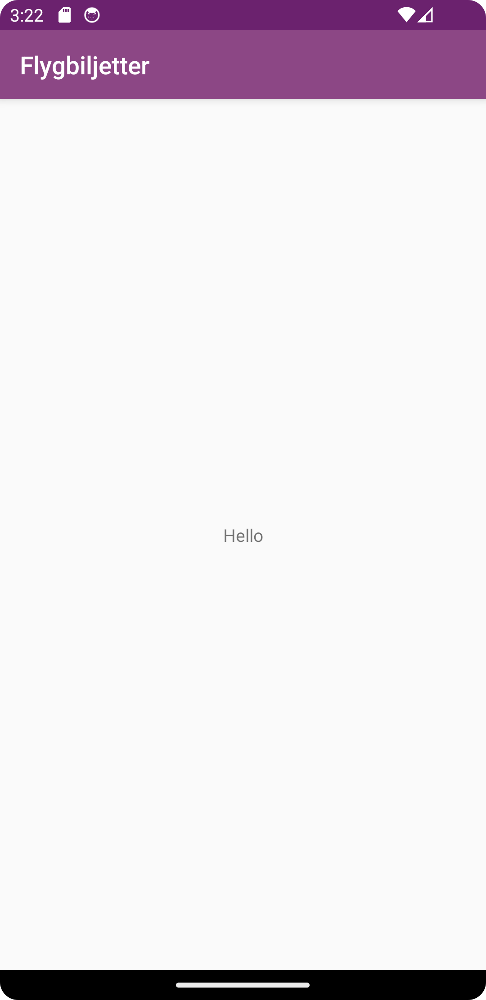

# Rapport


Jag ändrade primarycolor och de andra två färgerna till en mer rosa-lila nyans. Istället för 
"Hello World!" så la jag flygbiljetter t.ex en app för att köpa flygbiljetter.
Denna koden är för rubriken.
```
<activity
            android:name=".MainActivity"
            android:label="Flygbiljetter"
            android:theme="@style/AppTheme.NoActionBar">
...

</activity>

```

Denna koden är för färgerna bakom rubriken längst upp.
```
<?xml version="1.0" encoding="utf-8"?>
<resources>
    <color name="colorPrimary">#ac38b0</color>
    <color name="colorPrimaryDark">#6b226e</color>
    <color name="colorAccent">#d16089</color>
</resources>
```

Bilder läggs i samma mapp som markdown-filen.




